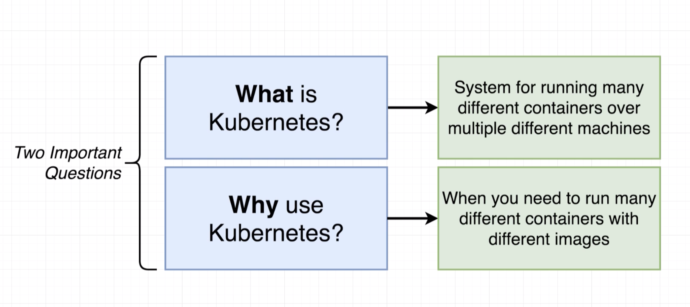

# Docker with Kubernetes (k8s)


## Docker CLI

### Basics
`docker help`   
`docker <COMMAND> --help`   
`docker version`    
`docker system info`    
`docker system df`  
`docker container stats` Display a live stream of container(s) resource usage statistics    

`docker login`  
`docker logout` 

`docker create <IMAGE_NAME> <COMMAND>`  
`docker start <CONTAINER_ID>`, `docker start -a <CONTAINER_ID>`  
`docker stop <CONTAINER_ID>`    
`docker kill <CONTAINER_ID>`    
`docker run <IMAGE_NAME> <COMMAND>`     
`docker run -d <IMAGE_NAME>` Run a Container from an Image with Detach (Run in Background) Mode     
`docker run -it <IMAGE_NAME> <COMMAND>`     
`docker exec -it <CONTAINER_ID> <COMMAND>`      

`docker ps`, `docker ps --all`  
`docker logs <CONTAINER_ID>`    

`docker container prune`    
`docker system prune --volumes`     
`docker image prune`    
`docker volume prune`   
`docker network prune`  
`docker system prune`   


### 1. Container
> If you don't specify (container, image, network, ..) after `docker ...`, default would be (container) 
`docker ps` = `docker container ps`   

`docker container ls`, `docker ps`  
`docker container stop <CONTAINER_ID>`  
`docker container rm <CONTAINER_ID>`    
`docker stop $(docker ps -aq)` Stops All Containers 
`docker rm $(docker ps -aq)` Removes All Containers 
`docker ps -a | awk '{ print $1,$2 }' | grep <IMAGE_NAME> | awk '{print $1 }' | xargs -I {} docker rm {}` Removed All Containers for an Image    

`docker container run -p <HOST_PORT>:<CONTAINER_PORT> --name <CONTAINER_NAME> <IMAGE_ID>`   
`docker container run -p <HOST_PORT>:<CONTAINER_PORT> -v <HOST_FOLDER>:<CONTAINER_FOLDER> <IMAGE_ID>`   
`docker container run -p <HOST_PORT>:<CONTAINER_PORT> --name <CONTAINER_NAME> -it <IMAGE_ID> <COMMAND>` 
`docker container run --publ-t ish <HOST_PORT>:<CONTAINER_PORT> --name <CONTAINER_NAME> <IMAGE_ID> --detach <COMMAND>`      
    - `--name` Assign a name to the container   
    - `--publish` Publish a container’s port(s) to the host <HOST_PORT>:<CONTAINER_PORT>    
    - `--detach` Run container in background and print container ID 
    
`docker port <CONTAINER_ID>` List port mappings for the container   
`docker port <CONTAINER_ID> <PRIVATE_PORT>` List specific port mappings for the container   

`docker container inspect --format '{{ .NetworkSettings.IPAddress }}' <CONTAINER_NAME>` 
`docker container exec -it <CONTAINER_NAME> <COMMAND>`  
`docker container logs <CONTAINER_NAME>` Fetch the logs of a container  
`docker container logs -f <CONTAINER_NAME>` Fetch the logs of a container and tail it   
`docker container top <CONTAINER_NAME>` Display the running processes of a contain  

### 2. Image
`docker image ls`   
`docker image ls -a`    
`docker image pull <IMAGE[:TAG]>`   
`docker image push <IMAGE[:TAG]>`   
`docker image tag <SOURCE_IMAGE[:TAG]> <TARGET_IMAGE[:TAG]>`    
`docker image build -t [:TAG] .`    
`docker image build -t <YOUR_DOCKER_ID/REPO_NAME/VERSION> .`    
`docker history <IMAGE[:TAG]>`  
`docker image rm <IMAGE>`   
`docker rmi $(docker images -q)` Removes All Images 

### 3. Volume
> If you start a container with a volume that does not yet exist, Docker creates the volume for you.

`docker volume ls`
`docker volume create <VOLUME_NAME>`    
`docker volume inspect <VOLUME_NAME>`   
`docker volume rm <VOLUME_NAME>`    
`docker rm $(docker volume -q)` 

### 4. Network
`docker network ls` 
`docker network ls -a`  
`docker network inspect <NETWORK_ID>`   

`docker network create --driver <NETWORK_ID>` Create a network  
`docker network connect <NETWORK_ID> <CONTAINER_NAME>` Connect a container to a network 
`docker network disconnect <NETWORK_ID> <CONTAINER_NAME>` Disconnect a container to a network   
`docker network rm <NETWORK_ID>`    


## Dockerfile
- Use an Existing Docker Image as a Base    
- Download and Install Dependencies 
- Command to be Run, when a Container Instantiated from this Image Starts   

`docker build .`    
`docker image build -t <YOUR_DOCKER_ID/REPO_NAME/VERSION> .`    
`docker build -f <DOCKERFILE_NAME> .`   


## Docker Compose
`docker-compose ps` Lists containers in the context of docker-compose file  
`docker-compose up` Run Containers  
`docker-compose up -d` Run Containers in Detach Mode (Run in Background)        
`docker-compose up --build` Build Images and Run Containers     
`docker-compose build <SERVICE_NAME>` Build Single Image    
`docker-compose down` Stop and Remove Containers    


## Production Workflow  
1. Development  
2. Testing  
3. Deployment   


## Tools

1. Development Tools
- Docker (Dockerfile)
- Docker Compose (docker-compose.yml)
- Docker Hub [#](https://hub.docker.com/)

2. Version Control System Repository
- Github [#](https://github.com/)

3. Continuous Integration Services
- Travis CI [#](https://travis-ci.com/)
- Jenkins CI [#](https://jenkins.io/)

4. Cloud Services
- Amazon Web Services (AWS) [#](https://aws.amazon.com/)
- AWS Elastic Beanstalk (Orchestration Service)
- AWS RDS (Relational Database Service)
- AWS ElastiCache (In-Memory Data Store)
- Amazon EKS (Elastic Kubernetes Service)


## Kubernetes [#](https://kubernetes.io/)



#### Tools
- Kubectl (Kubernetes CLI)
- Virtual Box
- Minikube

#### Useful Commands
```
minikube ip
minikube start
minikube start --vm-driver=virtualbox
minikube status
minikube dashboard
kubectl cluster-info
```

`kubectl apply -f <CONFIG_FILE>` Feed a config file to Kubectl  
`kubectl delete -f <CONFIG_FILE>` Delete an existing pod   
`kubectl delete -f <CONFIGS_DIR>` Delete all resources based on all config in a directory       
`kubectl get <OBJECT_TYPE>` Get the status of all running object types   
`kubectl get pods` Get the status of all running pods   
`kubectl get services` Get the status of all running services
`kubectl get deployments` Get the status of all running deployments    
`kubectl get pv` Get all persistent volumes 
`kubectl get pvc` Get all persistent volume claims   
`kubectl get secrets` Get all secrets                

`kubectl describe pod <POD_NAME>`   
`kubectl get pods -o wide`  

`kubectl set <PROPERTY_TO_CHANGE> <OBJECT_TYPE>/<OBJECT_NAME> <TARGET_CONTAINER_NAME> = <PROPERTY_NEW_VALUE>`   
`kubectl set image deployment/client-deployment client=amiroous/docker-k8s-fibonacci-client:v2.0`   
`kubectl get storageclass`      
`kubectl describe storageclass`

`kubectl create secret <SECRET_TYPE> <SECRET_NAME> --from-literal key=value`
`kubectl describe secrets/<SECRET_NAME>`

#### Change Code & Deploy Steps:
1. Change the Code Base         
2. Re-Build Effected Images (Using Docker Build or Docker Compose or Make) `docker build -t amiroous/docker-k8s-fibonacci-client ./client`      
3. Push Updated Images to Docker Hub        
4. Set the Kubernetes Config by Kubectl Set Command     


### Configure Local Docker Client (CLI) for Kubernetes on VM
> Configure Local Docker Client (CLI) to Talk to Docker Server Inside of Virtual Machine (Instead of Docker Server Locally)     
> This only configures current open terminal window and is temporary (`minikube docker-env`)

`eval $(minikube docker-env)`


### Kubernetes Ingress Nginx Controller
[1](https://kubernetes.github.io/ingress-nginx/)


